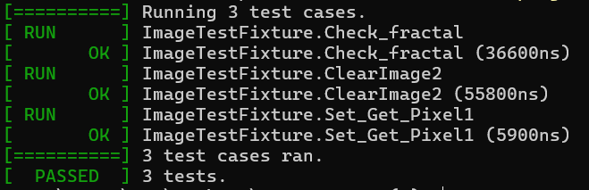

## 04.Fractal

### задача:

- Проект со сборкой на основе Make, **CMake** или Meson и **юнит-тестами**, запускаемыми из **CI**.
- C/доделать программу, котрая рисует несколько видов фракталов и сохраняет изображения с ними в любом графическом формате.

### результаты:

- построенно три фрактала
  - фрактал который строит посреди непересеченного отрезка перпендикулярный отрезок такойже длины
  - фрактал который на концах отрезка строит перпендикулярный отрезок размером 2/3 от исходного
  - пустой фрактал который на прозрачной области рисует прозрачную область поменьше
  - 
- тест кейс на проверку фрактала пройден
  - 

### выводы:

библиотека из одного заголовчного файла это лучший вариант си библиотеки из возможных
